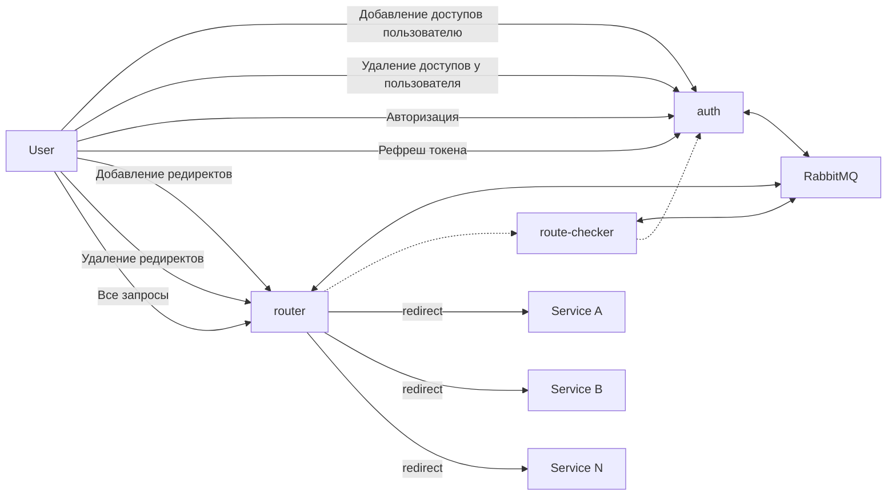

# Cloud Gateway

Использует микросервисный подход на [NestJS](https://nestjs.com/) с использованием транспорта на [RMQ](https://www.rabbitmq.com/)

## Топология



## Для тестирования

1. Апи с добавлением ресурсов в `auth` сервисе находятся в [скрипте](./scripts/auth_n_test.sh)
2. Весь трафик идёт через `router` сервиc
3. Авторизация идёт через `auth` сервис 
4. `route-checker` - промежуточный сервис


### Тестирование, разработка

Перед запуском локально устанвливаем модули в корневой папке


```bash
npm i
```

Чтобы протестировать сервисы без docker-compose можно запускать их в dev режиме через

```bash
npm run start:dev
```

> Чтобы работало взаимодействие надо запустить брокер:

```bash
docker run -d \
  --name rabbitmq \
  -p 5672:5672 \
  -p 15672:15672 \
  -e RABBITMQ_DEFAULT_USER=user \
  -e RABBITMQ_DEFAULT_PASS=password \
  rabbitmq:3-management
```

- `5672` - порт для AMQP
- `15672` - дашборд по запросам RMQ


## Запуск

Для запуска всех сервисов в [папке](./deploy/local_cluster/) можно запустить

```bash
docker compose up -d
```

### Документация

Swagger запущен на сервисах `router` и `auth`.

- router: `http://localhost:3002/swagger/api`
- auth: `http://localhost:3001/swagger/api`

openapi.json файлы сохранены в папках сервисов:

- [auth](./services/auth/swagger/openapi.json)
- [router](./services/router/swagger/openapi.json)

### Тесты

Тесты работоспособности:

Скрипты на bash:

- [add_resources.sh](./scripts/add_resources.sh) - проверка добавления и перенаправления трафика на ресурсы
- [auth_n_test.sh](./scripts/auth_n_test.sh) - проверка на добавление и удаление ресурсов на пользователя, а также проверка авторизации по BasicAuth и JWT

Тесты на jest:

- [integrational.spec.js](./tests/integrational.spec.js) - аналогично тестам на bash, только можно проверить дополнительно с помощью debug.